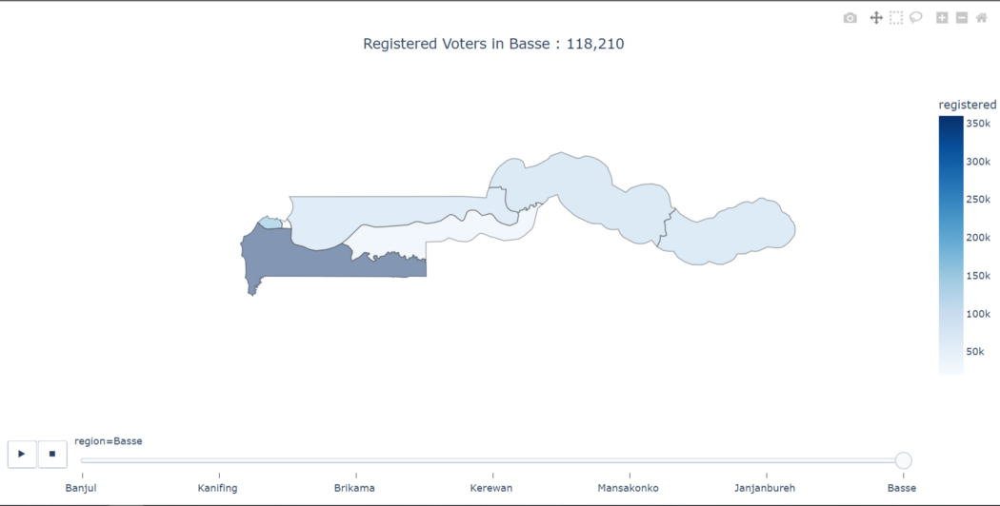
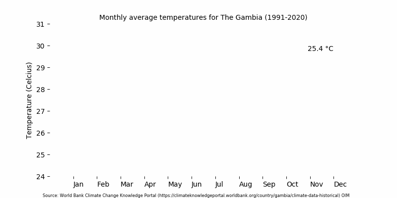

# John Doe
*An Aspiring Data Analyst | Statistician by profession*

# Education
* Bachelors of Science (Economics), *University of The Gambia*, 2011-2015

# [Project 1: The Gambia 2021 Election Registration Data Analysis](https://outhman-i-m.github.io/Election-2021/)

Photo by Author

This project gives detailed information about The Gambia Election 2021 Registration Statistics via an interactive map
* **Python libraries used:** Pandas, Geopandas, Plotly
* **Input:** The Gambia Election 2021 Registration Statistics, The Gambia Administratrive Data Shapefile
* **Output:** Interactive map of number of registered voters, constituencies, and polling stations in each administrative area

# Project 2: Average Temperature in The Gambia, 1991-2020

Photo by Author

This project aims to dispel the popular notion than October is the hottest month in The Gambia by showing the average monthly temperature from 1991 to 2020
* **Python libraries used:** Pandas, Matplotlib.pyplot and Matplotlib.animation, Datetime
* **Input:** Timeseries temperature data for The Gambia from World Bank Climate Knowledge Portal (https://climateknowledgeportal.worldbank.org/country/gambia/climate-data-historical)
* **Output:** A GIF image showing average monthly temperature over the reference period.

# [Project 3: Crypto Trading Bot](http://youtube.com/dataprofessor)

Photo by <a href="https://unsplash.com/@nampoh?utm_source=unsplash&utm_medium=referral&utm_content=creditCopyText">Maxim Hopman</a> on <a href="https://unsplash.com/s/photos/cryptocurrency-trading?utm_source=unsplash&utm_medium=referral&utm_content=creditCopyText">Unsplash</a>

This project makes use of ***sentiment analysis*** of cryptocurrency coupled with ***technical analysis*** in the trading of cryptocurrencies.
* **Python libraries used:** Streamlit, python-binance, cctx, talib
* **Input:** Cryptocurrency historical price
* **Output:** Trading signals triggers buying and selling
